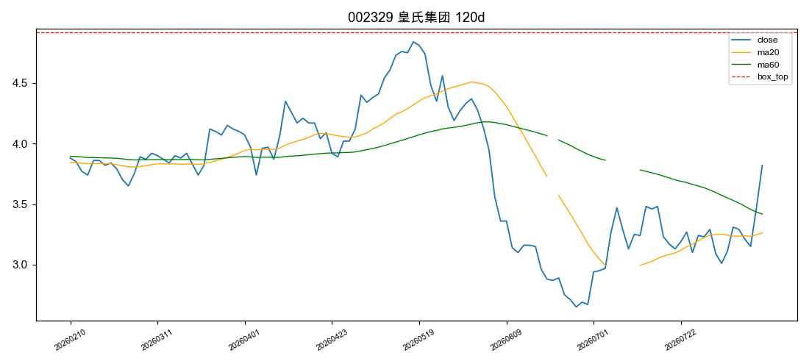
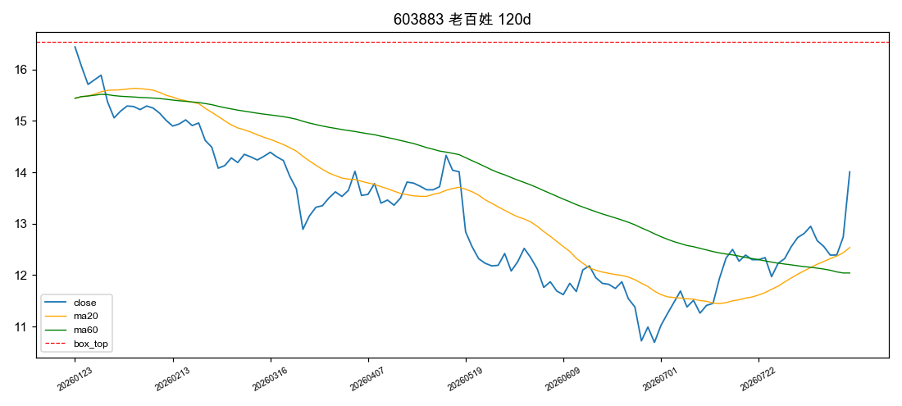
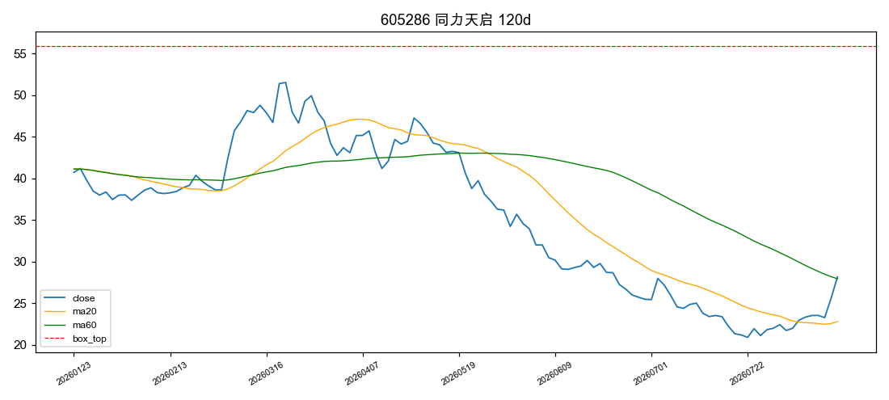
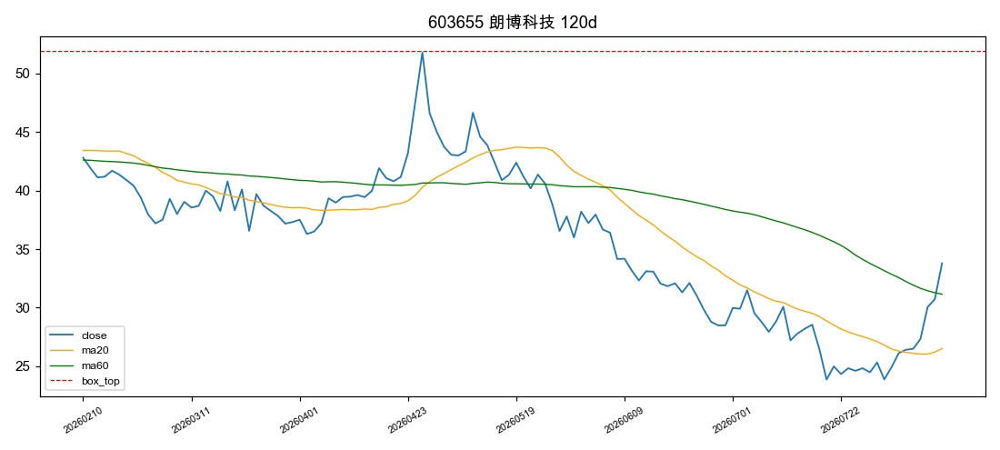
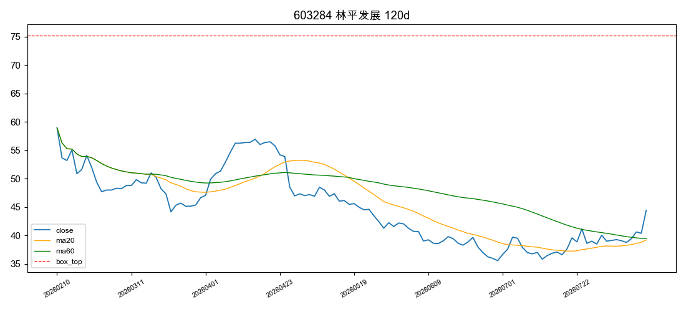
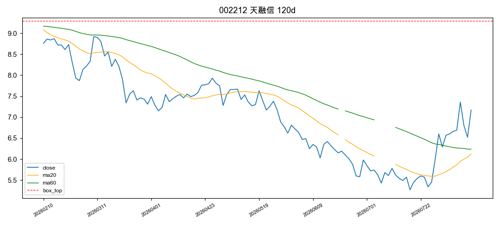
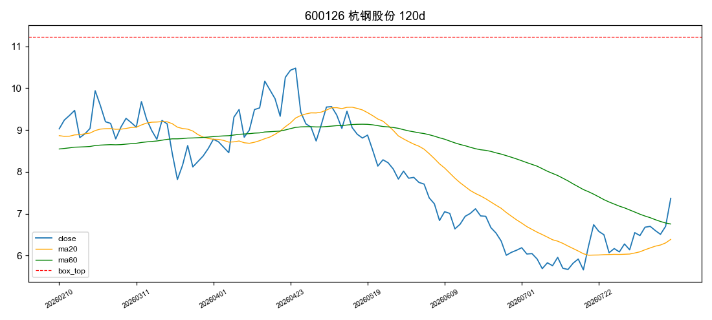
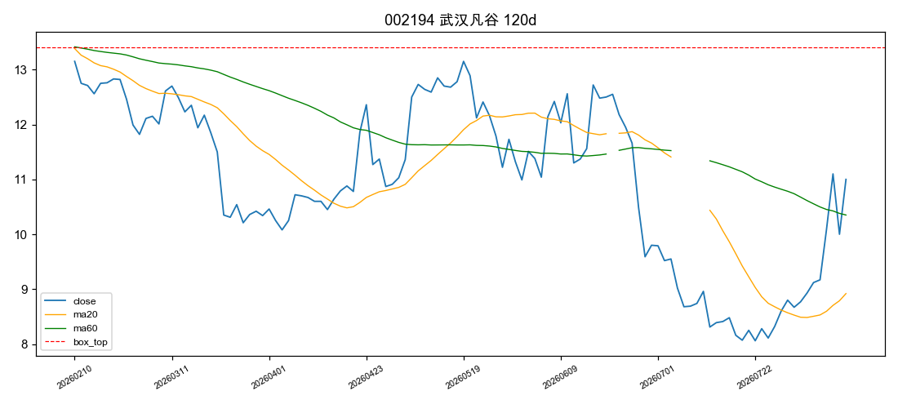
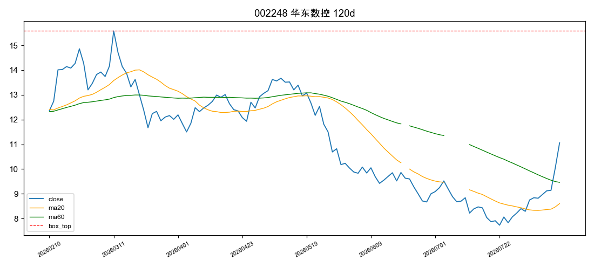
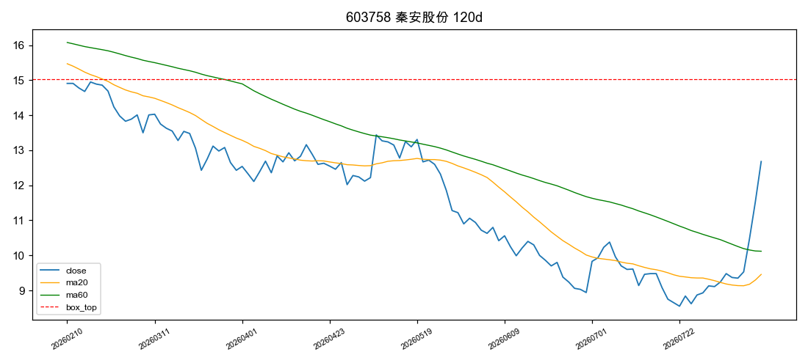

# 主板涨停股趋势分析报告（20260811）

> 筛选口径：沪深主板（60/00）涨停（change_pct≥9.9%）、剔除ST/*ST、总市值≥30亿；
> 形态：120日横盘/下跌 + 近5日转升确认。⛔本报告为数据筛选结果，不构成投资建议；策略样本外验证=beta非alpha。

## 一、筛选漏斗

| 环节 | 只数 |
|---|---|
| 主板涨停（含ST） | 52 |
| 剔除ST/*ST | -1 |
| 市值<30亿剔除 | -5 |
| 市值缺失（保留并标注） | 0 |
| K线历史不足120日 | -0 |
| **入池打分** | **46** |

## 二、入池股票评分总表

| 排名 | 代码 | 名称 | 市值(亿) | 形态 | 评分 | 近5日 | 近20日 | 振幅比 | 斜率(%/日) | 120日收益 | 量比(amount) | 突破 | 均线多头 | 安全垫 | 连板 | 一字板 | 买入风险 |
|---|---|---|---|---|---|---|---|---|---|---|---|---|---|---|---|---|---|
| 1 | 002329 | 皇氏集团 | 31.8 | 下跌型 | 100 | 15.4% | 9.8% | 0.61 | -0.23 | -1.5% | 1.34 | ✅ | ✅ | ✅ | 2 | — | 高 |
| 2 | 603883 | 老百姓 | 106.3 | 下跌型 | 100 | 10.6% | 17.3% | 0.47 | -0.25 | -14.8% | 1.32 | ✅ | ✅ | ✅ | 1 | — | 低 |
| 3 | 605286 | 同力天启 | 47.3 | 下跌型 | 100 | 20.7% | 20.3% | 0.94 | -0.58 | -30.9% | 1.23 | ✅ | ✅ | ✅ | 2 | — | 高 |
| 4 | 603655 | 朗博科技 | 35.8 | 下跌型 | 100 | 28.0% | 21.5% | 0.79 | -0.39 | -21.1% | 1.63 | ✅ | ✅ | ✅ | 1 | — | 低 |
| 5 | 603284 | 林平发展 | 33.5 | 下跌型 | 100 | 13.7% | 21.8% | 0.89 | -0.33 | -24.6% | 1.99 | ✅ | ✅ | ✅ | 1 | — | 低 |
| 6 | 002212 | 天融信 | 84.6 | 下跌型 | 100 | 7.7% | 29.4% | 0.57 | -0.36 | -18.2% | 2.82 | ✅ | ✅ | ✅ | 1 | — | 高 |
| 7 | 600126 | 杭钢股份 | 248.9 | 下跌型 | 100 | 10.3% | 30.0% | 0.69 | -0.42 | -18.4% | 1.62 | ✅ | ✅ | ✅ | 1 | — | 高 |
| 8 | 002194 | 武汉凡谷 | 75.2 | 下跌型 | 100 | 20.6% | 31.1% | 0.50 | -0.24 | -16.3% | 1.60 | ✅ | ✅ | ✅ | 1 | — | 高 |
| 9 | 002248 | 华东数控 | 34.0 | 下跌型 | 100 | 25.4% | 31.8% | 0.69 | -0.48 | -10.5% | 1.66 | ✅ | ✅ | ✅ | 2 | — | 高 |
| 10 | 603758 | 秦安股份 | 54.9 | 下跌型 | 100 | 35.3% | 34.0% | 0.54 | -0.42 | -15.0% | 1.59 | ✅ | ✅ | ✅ | 3 | ⚠️ | 高 |
| 11 | 600611 | 大众交通 | 118.7 | 下跌型 | 100 | 17.8% | 38.3% | 0.67 | -0.29 | -14.5% | 2.04 | ✅ | ✅ | ✅ | 1 | — | 高 |
| 12 | 002235 | 安妮股份 | 55.4 | 下跌型 | 85 | 15.6% | 0.8% | 0.63 | -0.25 | -10.8% | 0.68 | ✅ | ✅ | ✅ | 1 | — | 低 |
| 13 | 603087 | 甘李药业 | 445.3 | 横盘型 | 85 | 6.4% | 6.4% | 0.38 | 0.02 | 11.9% | 1.33 | ✅ | ✅ | — | 1 | ⚠️ | 高 |
| 14 | 002031 | 巨轮智能 | 128.4 | 下跌型 | 85 | 11.2% | 12.3% | 0.72 | -0.32 | -26.0% | 0.59 | ✅ | ✅ | ✅ | 1 | — | 低 |
| 15 | 603887 | 城地香江 | 62.1 | 下跌型 | 85 | 8.2% | 21.3% | 0.73 | -0.62 | -28.0% | 1.08 | ✅ | ✅ | ✅ | 1 | — | 低 |
| 16 | 002256 | 兆新股份 | 81.0 | 下跌型 | 85 | 16.4% | 21.8% | 0.72 | -0.14 | 7.3% | 0.81 | ✅ | ✅ | ✅ | 1 | — | 低 |
| 17 | 002246 | 北化股份 | 123.4 | 下跌型 | 85 | 12.3% | 23.8% | 0.49 | -0.23 | 16.5% | 0.93 | ✅ | ✅ | ✅ | 1 | — | 低 |
| 18 | 002229 | 鸿博股份 | 58.2 | 下跌型 | 85 | 6.1% | 24.4% | 0.72 | -0.57 | -28.6% | 0.98 | ✅ | ✅ | ✅ | 1 | — | 低 |
| 19 | 000859 | 国风新材 | 93.9 | 下跌型 | 85 | 25.4% | 30.0% | 0.61 | -0.19 | -10.1% | 1.03 | ✅ | ✅ | ✅ | 2 | — | 高 |
| 20 | 002721 | 金一文化 | 81.1 | 下跌型 | 85 | 25.5% | 35.6% | 0.50 | -0.31 | -12.6% | 7.35 | ✅ | ✅ | — | 1 | — | 高 |
| 21 | 600272 | 开开实业 | 41.2 | 下跌型 | 85 | 45.5% | 38.9% | 0.49 | -0.20 | 12.4% | 7.49 | ✅ | ✅ | — | 4 | — | 高 |
| 22 | 603106 | 恒银科技 | 48.6 | 下跌型 | 85 | 3.3% | 45.5% | 0.54 | -0.35 | -11.8% | 12.75 | ✅ | ✅ | — | 1 | — | 高 |
| 23 | 600721 | 百花医药 | 49.0 | 下跌型 | 85 | 61.0% | 85.3% | 0.77 | -0.23 | 39.5% | 5.40 | ✅ | ✅ | — | 6 | ⚠️ | 高 |
| 24 | 605179 | 一鸣食品 | 110.8 | 下跌型 | 85 | 27.4% | 111.2% | 0.88 | -0.23 | 31.8% | 5.96 | ✅ | ✅ | — | 2 | — | 高 |
| 25 | 603012 | 创力集团 | 57.8 | 横盘型 | 70 | 5.2% | 3.8% | 0.40 | 0.01 | 10.5% | 1.75 | — | ✅ | — | 1 | — | 低 |
| 26 | 002685 | 华东重机 | 61.2 | 下跌型 | 70 | 13.2% | 11.6% | 0.76 | -0.28 | -17.2% | 0.63 | — | ✅ | ✅ | 1 | — | 低 |
| 27 | 000802 | 北京文化 | 37.0 | 横盘型 | 70 | 22.2% | 45.2% | 0.51 | -0.07 | -1.7% | 1.97 | — | ✅ | — | 2 | ⚠️ | 高 |
| 28 | 605288 | 凯迪股份 | 62.7 | 下跌型 | 55 | 7.2% | -6.6% | 1.13 | -0.70 | -48.0% | 0.30 | — | — | ✅ | 1 | — | 低 |
| 29 | 603179 | 新泉股份 | 297.5 | 下跌型 | 55 | 5.8% | -5.5% | 0.86 | -0.62 | -51.5% | 0.55 | — | — | ✅ | 1 | — | 低 |
| 30 | 603009 | 北特科技 | 152.4 | 下跌型 | 55 | 9.9% | -2.7% | 0.53 | -0.17 | -16.1% | 0.56 | — | — | ✅ | 1 | — | 低 |
| 31 | 002687 | 乔治白 | 30.2 | 横盘型 | 55 | 22.0% | 7.4% | 0.41 | -0.01 | 13.9% | 1.02 | ✅ | — | — | 1 | — | 低 |
| 32 | 600881 | 亚泰集团 | 60.4 | 横盘型 | 40 | 5.6% | 12.0% | 0.46 | -0.02 | 2.2% | 0.89 | — | — | — | 1 | — | 低 |
| 33 | 002963 | 豪尔赛 | 30.2 | 不符合 | 30 | 25.6% | 12.4% | 0.80 | 0.14 | 27.6% | 2.25 | — | ✅ | — | 1 | — | 低 |
| 34 | 002762 | 金发拉比 | 36.5 | 不符合 | 30 | 14.2% | 34.9% | 0.50 | 0.22 | 47.9% | 3.59 | — | ✅ | — | 1 | — | 高 |
| 35 | 600664 | 哈药股份 | 208.3 | 不符合 | 30 | 28.2% | 102.7% | 1.54 | 0.39 | 134.3% | 3.25 | — | ✅ | — | 3 | — | 高 |
| 36 | 001258 | 立新能源 | 148.7 | 不符合 | 30 | 18.9% | 143.2% | 1.05 | 0.16 | 109.9% | 3.72 | — | ✅ | — | 2 | — | 高 |
| 37 | 600667 | 太极实业 | 443.4 | 不符合 | 15 | 23.6% | -6.3% | 1.85 | 0.84 | 119.5% | 1.14 | — | ✅ | — | 1 | — | 低 |
| 38 | 603137 | 恒尚节能 | 55.5 | 不符合 | 15 | 16.6% | -6.3% | 1.73 | 0.63 | 110.5% | 2.23 | — | — | — | 1 | — | 低 |
| 39 | 002859 | 洁美科技 | 368.9 | 不符合 | 15 | 35.5% | 4.9% | 1.48 | 0.70 | 108.2% | 0.76 | — | ✅ | — | 1 | — | 低 |
| 40 | 603897 | 长城科技 | 60.2 | 不符合 | 15 | 12.7% | 8.9% | 1.19 | -0.02 | 2.3% | 0.58 | — | ✅ | — | 1 | — | 低 |
| 41 | 002585 | 双星新材 | 120.1 | 不符合 | 15 | 17.5% | 11.0% | 1.10 | 0.37 | 44.1% | 0.72 | — | ✅ | — | 1 | — | 低 |
| 42 | 600683 | 京投发展 | 79.1 | 不符合 | 15 | 29.3% | 11.5% | 1.46 | 0.12 | 59.9% | 0.41 | — | ✅ | — | 2 | ⚠️ | 高 |
| 43 | 603823 | 百合花 | 313.2 | 不符合 | 15 | 36.2% | 13.1% | 3.24 | 1.59 | 322.8% | 1.29 | — | — | — | 1 | — | 低 |
| 44 | 000779 | 甘咨询 | 59.2 | 不符合 | 15 | -6.6% | 20.0% | 0.87 | 0.13 | 37.8% | 1.95 | — | — | — | 1 | — | 低 |
| 45 | 600162 | 香江控股 | 140.2 | 不符合 | 15 | 32.4% | 86.5% | 1.36 | 0.61 | 123.4% | 1.03 | — | ✅ | — | 1 | — | 高 |
| 46 | 600863 | 华能蒙电 | 405.9 | 不符合 | 0 | 6.8% | 12.6% | 0.76 | -0.02 | 7.2% | 0.39 | — | — | — | 1 | — | 低 |

## 三、Top10 逐只详析

### 1. 002329 皇氏集团（下跌型，100分）

- 市值 31.8 亿；120日振幅比 0.61，回归斜率 -0.23 %/日，区间收益 -1.5%
- 近期涨幅：近5日 15.4%，近20日 9.8%（≥25%标高风险=已反弹一段的接力票，非低位启动）
- 箱体上轨（前115日高点）4.92，今日收盘 3.82；突破=是
- 均线多头=是；量比(amount口径)=1.34（阈值1.2）；安全垫：距120日高点 -22.4% / 距250日高点 -22.4%
- 可买性：连板 2 天，一字板=否，次日买入风险 **高**

### 2. 603883 老百姓（下跌型，100分）

- 市值 106.3 亿；120日振幅比 0.47，回归斜率 -0.25 %/日，区间收益 -14.8%
- 近期涨幅：近5日 10.6%，近20日 17.3%（≥25%标高风险=已反弹一段的接力票，非低位启动）
- 箱体上轨（前115日高点）16.54，今日收盘 14.01；突破=是
- 均线多头=是；量比(amount口径)=1.32（阈值1.2）；安全垫：距120日高点 -15.3% / 距250日高点 -15.3%
- 可买性：连板 1 天，一字板=否，次日买入风险 **低**

### 3. 605286 同力天启（下跌型，100分）

- 市值 47.3 亿；120日振幅比 0.94，回归斜率 -0.58 %/日，区间收益 -30.9%
- 近期涨幅：近5日 20.7%，近20日 20.3%（≥25%标高风险=已反弹一段的接力票，非低位启动）
- 箱体上轨（前115日高点）55.87，今日收盘 28.17；突破=是
- 均线多头=是；量比(amount口径)=1.23（阈值1.2）；安全垫：距120日高点 -49.6% / 距250日高点 -49.6%
- 可买性：连板 2 天，一字板=否，次日买入风险 **高**

### 4. 603655 朗博科技（下跌型，100分）

- 市值 35.8 亿；120日振幅比 0.79，回归斜率 -0.39 %/日，区间收益 -21.1%
- 近期涨幅：近5日 28.0%，近20日 21.5%（≥25%标高风险=已反弹一段的接力票，非低位启动）
- 箱体上轨（前115日高点）51.90，今日收盘 33.79；突破=是
- 均线多头=是；量比(amount口径)=1.63（阈值1.2）；安全垫：距120日高点 -34.9% / 距250日高点 -34.9%
- 可买性：连板 1 天，一字板=否，次日买入风险 **低**

### 5. 603284 林平发展（下跌型，100分）

- 市值 33.5 亿；120日振幅比 0.89，回归斜率 -0.33 %/日，区间收益 -24.6%
- 近期涨幅：近5日 13.7%，近20日 21.8%（≥25%标高风险=已反弹一段的接力票，非低位启动）
- 箱体上轨（前115日高点）75.13，今日收盘 44.44；突破=是
- 均线多头=是；量比(amount口径)=1.99（阈值1.2）；安全垫：距120日高点 -40.8% / 距250日高点 -40.8%
- 可买性：连板 1 天，一字板=否，次日买入风险 **低**

### 6. 002212 天融信（下跌型，100分）

- 市值 84.6 亿；120日振幅比 0.57，回归斜率 -0.36 %/日，区间收益 -18.2%
- 近期涨幅：近5日 7.7%，近20日 29.4%（≥25%标高风险=已反弹一段的接力票，非低位启动）
- 箱体上轨（前115日高点）9.29，今日收盘 7.17；突破=是
- 均线多头=是；量比(amount口径)=2.82（阈值1.2）；安全垫：距120日高点 -22.8% / 距250日高点 -33.4%
- 可买性：连板 1 天，一字板=否，次日买入风险 **高**

### 7. 600126 杭钢股份（下跌型，100分）

- 市值 248.9 亿；120日振幅比 0.69，回归斜率 -0.42 %/日，区间收益 -18.4%
- 近期涨幅：近5日 10.3%，近20日 30.0%（≥25%标高风险=已反弹一段的接力票，非低位启动）
- 箱体上轨（前115日高点）11.22，今日收盘 7.37；突破=是
- 均线多头=是；量比(amount口径)=1.62（阈值1.2）；安全垫：距120日高点 -34.3% / 距250日高点 -34.3%
- 可买性：连板 1 天，一字板=否，次日买入风险 **高**

### 8. 002194 武汉凡谷（下跌型，100分）

- 市值 75.2 亿；120日振幅比 0.50，回归斜率 -0.24 %/日，区间收益 -16.3%
- 近期涨幅：近5日 20.6%，近20日 31.1%（≥25%标高风险=已反弹一段的接力票，非低位启动）
- 箱体上轨（前115日高点）13.40，今日收盘 11.0；突破=是
- 均线多头=是；量比(amount口径)=1.60（阈值1.2）；安全垫：距120日高点 -17.9% / 距250日高点 -27.4%
- 可买性：连板 1 天，一字板=否，次日买入风险 **高**

### 9. 002248 华东数控（下跌型，100分）

- 市值 34.0 亿；120日振幅比 0.69，回归斜率 -0.48 %/日，区间收益 -10.5%
- 近期涨幅：近5日 25.4%，近20日 31.8%（≥25%标高风险=已反弹一段的接力票，非低位启动）
- 箱体上轨（前115日高点）15.58，今日收盘 11.06；突破=是
- 均线多头=是；量比(amount口径)=1.66（阈值1.2）；安全垫：距120日高点 -29.0% / 距250日高点 -29.0%
- 可买性：连板 2 天，一字板=否，次日买入风险 **高**

### 10. 603758 秦安股份（下跌型，100分）

- 市值 54.9 亿；120日振幅比 0.54，回归斜率 -0.42 %/日，区间收益 -15.0%
- 近期涨幅：近5日 35.3%，近20日 34.0%（≥25%标高风险=已反弹一段的接力票，非低位启动）
- 箱体上轨（前115日高点）15.03，今日收盘 12.68；突破=是
- 均线多头=是；量比(amount口径)=1.59（阈值1.2）；安全垫：距120日高点 -15.6% / 距250日高点 -30.9%
- 可买性：连板 3 天，一字板=是，次日买入风险 **高**

## 四、方法学与局限

- 形态分类：横盘型=振幅比<0.55且|收益|<20%且|斜率|<0.1%/日；下跌型=斜率<-0.1%/日或收益<-20%（阈值经分析师用今日候选分布实测校准）。
- 量能用 amount（元）而非 volume：volume 在 20260518-0525 存在股→手单位切换污染；amount 近60日 NULL 率~8%，有效样本<40 标"—"。
- 箱体上轨=剔除近5日的前115日高点（避免突破与安全垫互斥）；安全垫横盘型看250日高点、下跌型看120日高点。
- 市值为腾讯实时快照（总市值，亿）；缺失者不剔除但标注。
- 复核SQL：`SELECT stock_code, trade_date, close_price, change_pct, amount, ma5, ma20, ma60 FROM stock_kline WHERE stock_code='<代码>' ORDER BY trade_date DESC LIMIT 125;`
- 可买性高风险触发：连板≥2、一字板、**近20日涨幅≥25%**（已反弹一段的接力票，非低位启动，0805教训）；同分并列按近20日涨幅升序（越低位越前）。
- 局限：单日快照，无盘中承接/封单数据；评分是形态初筛非买入信号；⛔策略未盈利禁实盘。

## 五、被过滤名单

**ST剔除（1）**：600107 *ST尔雅

**市值<30亿剔除（5）**：002715 登云股份(20.7亿), 603797 联泰环保(29.1亿), 600833 第一医药(27.0亿), 603488 展鹏科技(27.4亿), 603188 亚邦股份(27.8亿)
