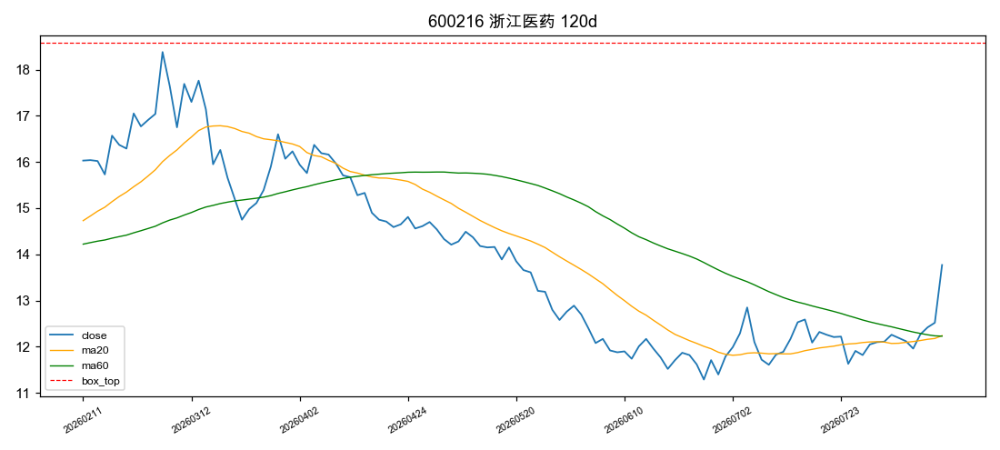
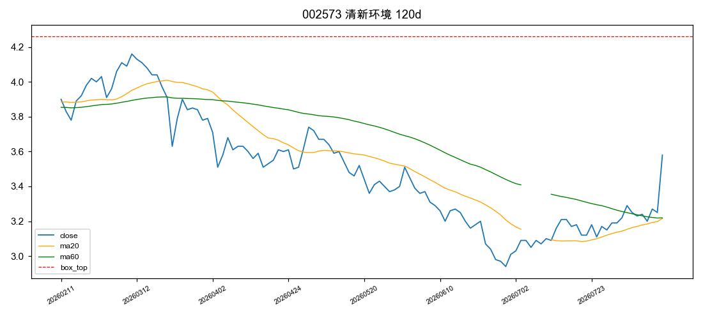
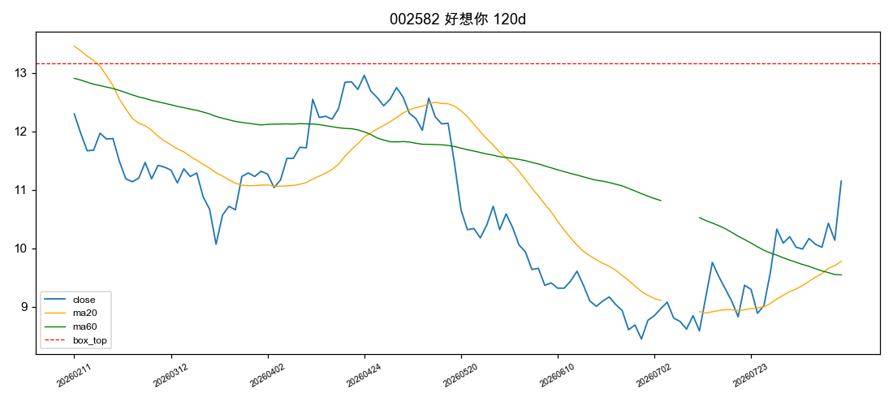
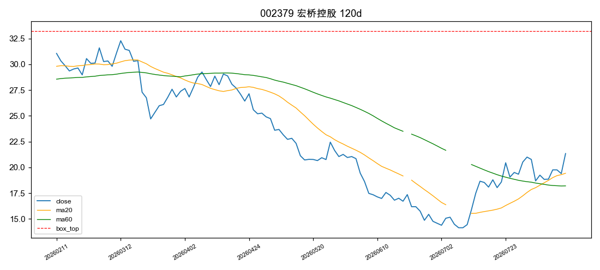
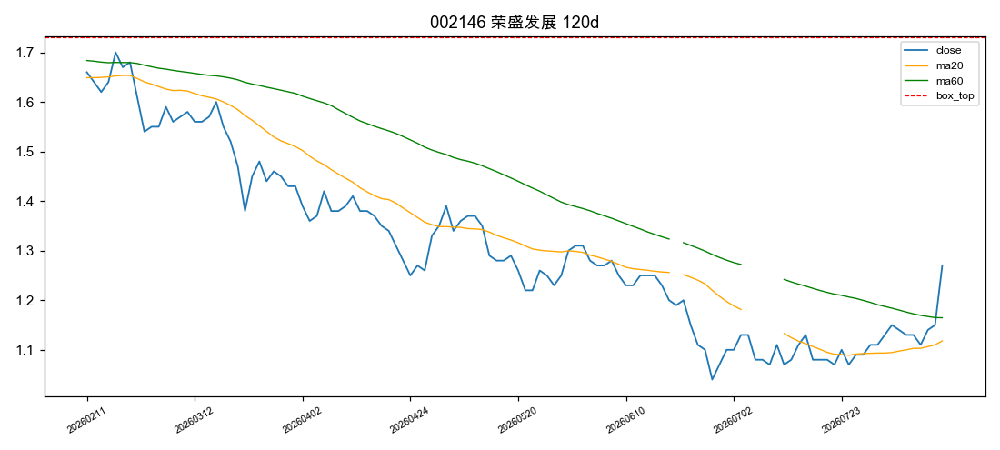
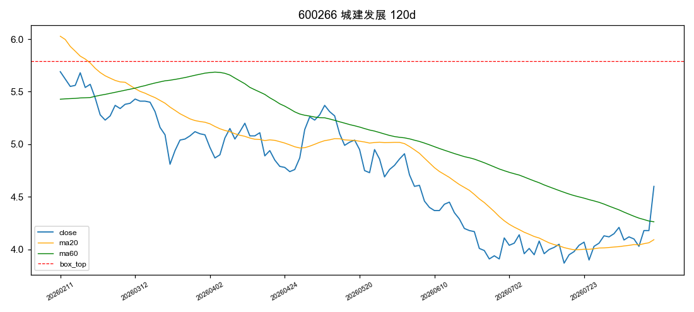
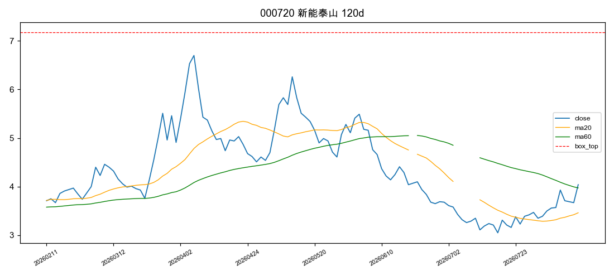
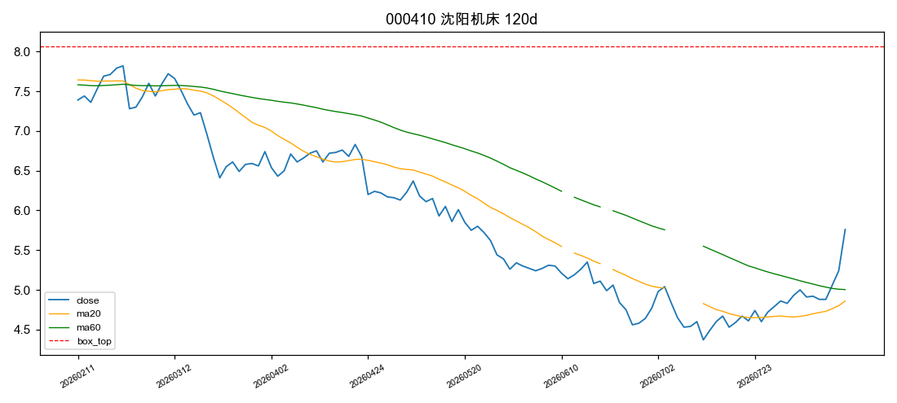
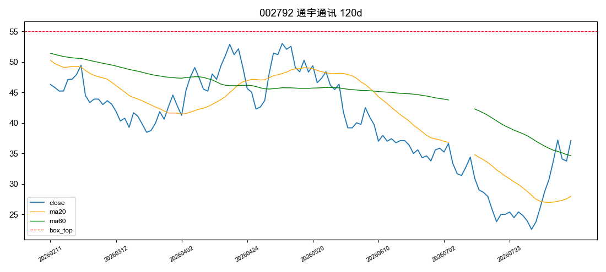
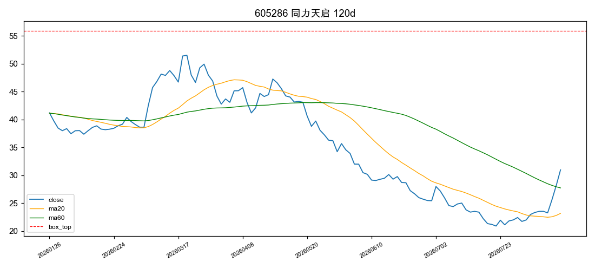

# 主板涨停股趋势分析报告（20260812）

> 筛选口径：沪深主板（60/00）涨停（change_pct≥9.9%）、剔除ST/*ST、总市值≥30亿；
> 形态：120日横盘/下跌 + 近5日转升确认。⛔本报告为数据筛选结果，不构成投资建议；策略样本外验证=beta非alpha。

## 一、筛选漏斗

| 环节 | 只数 |
|---|---|
| 主板涨停（含ST） | 88 |
| 剔除ST/*ST | -2 |
| 市值<30亿剔除 | -8 |
| 市值缺失（保留并标注） | 0 |
| K线历史不足120日 | -0 |
| **入池打分** | **78** |

## 二、入池股票评分总表

| 排名 | 代码 | 名称 | 市值(亿) | 形态 | 评分 | 近5日 | 近20日 | 振幅比 | 斜率(%/日) | 120日收益 | 量比(amount) | 突破 | 均线多头 | 安全垫 | 连板 | 一字板 | 买入风险 |
|---|---|---|---|---|---|---|---|---|---|---|---|---|---|---|---|---|---|
| 1 | 600216 | 浙江医药 | 132.4 | 下跌型 | 100 | 13.6% | 9.9% | 0.55 | -0.36 | -14.1% | 1.86 | ✅ | ✅ | ✅ | 1 | — | 低 |
| 2 | 002573 | 清新环境 | 50.7 | 下跌型 | 100 | 10.8% | 11.5% | 0.40 | -0.24 | -8.2% | 1.67 | ✅ | ✅ | ✅ | 1 | — | 低 |
| 3 | 002582 | 好想你 | 49.9 | 下跌型 | 100 | 9.6% | 14.2% | 0.45 | -0.24 | -9.3% | 1.56 | ✅ | ✅ | ✅ | 1 | — | 低 |
| 4 | 002379 | 宏桥控股 | 2780.8 | 下跌型 | 100 | 13.3% | 14.4% | 0.92 | -0.59 | -31.3% | 1.56 | ✅ | ✅ | ✅ | 1 | — | 低 |
| 5 | 002146 | 荣盛发展 | 55.2 | 下跌型 | 100 | 12.4% | 14.4% | 0.58 | -0.36 | -23.5% | 1.55 | ✅ | ✅ | ✅ | 1 | — | 低 |
| 6 | 600266 | 城建发展 | 95.5 | 下跌型 | 100 | 11.7% | 14.4% | 0.41 | -0.30 | -19.2% | 1.70 | ✅ | ✅ | ✅ | 1 | — | 低 |
| 7 | 000720 | 新能泰山 | 50.8 | 下跌型 | 100 | 13.2% | 24.7% | 0.99 | -0.23 | 8.9% | 1.30 | ✅ | ✅ | ✅ | 1 | — | 低 |
| 8 | 000410 | 沈阳机床 | 152.6 | 下跌型 | 100 | 17.1% | 25.2% | 0.64 | -0.47 | -22.1% | 1.51 | ✅ | ✅ | ✅ | 1 | — | 高 |
| 9 | 002792 | 通宇通讯 | 194.4 | 下跌型 | 100 | 20.7% | 29.6% | 0.82 | -0.41 | -19.9% | 2.02 | ✅ | ✅ | ✅ | 1 | — | 高 |
| 10 | 605286 | 同力天启 | 52.1 | 下跌型 | 100 | 31.6% | 31.6% | 0.94 | -0.58 | -24.8% | 1.33 | ✅ | ✅ | ✅ | 3 | ⚠️ | 高 |
| 11 | 603696 | 安记食品 | 36.2 | 下跌型 | 100 | 14.5% | 33.7% | 0.67 | -0.42 | -19.9% | 4.09 | ✅ | ✅ | ✅ | 1 | — | 高 |
| 12 | 600376 | 首开股份 | 114.0 | 下跌型 | 100 | 4.2% | 33.9% | 0.72 | -0.45 | -20.2% | 1.43 | ✅ | ✅ | ✅ | 1 | — | 高 |
| 13 | 002248 | 华东数控 | 37.4 | 下跌型 | 100 | 35.7% | 43.7% | 0.69 | -0.47 | -4.5% | 3.11 | ✅ | ✅ | ✅ | 3 | — | 高 |
| 14 | 002357 | 富临运业 | 31.3 | 下跌型 | 85 | 11.7% | 5.0% | 0.77 | -0.56 | -25.6% | 0.67 | ✅ | ✅ | ✅ | 1 | — | 低 |
| 15 | 601155 | 新城控股 | 274.5 | 下跌型 | 85 | 11.2% | 8.6% | 0.55 | -0.40 | -29.1% | 1.50 | ✅ | — | ✅ | 1 | — | 低 |
| 16 | 603277 | 银都股份 | 71.2 | 下跌型 | 85 | 8.0% | 12.0% | 0.57 | -0.45 | -30.3% | 1.34 | ✅ | — | ✅ | 1 | — | 低 |
| 17 | 002483 | 润邦股份 | 51.0 | 下跌型 | 85 | 9.3% | 13.0% | 0.60 | -0.45 | -22.5% | 1.07 | ✅ | ✅ | ✅ | 1 | ⚠️ | 高 |
| 18 | 002562 | 兄弟科技 | 57.7 | 下跌型 | 85 | 10.5% | 13.5% | 0.70 | -0.49 | -33.4% | 1.11 | ✅ | ✅ | ✅ | 1 | — | 低 |
| 19 | 603615 | 茶花股份 | 43.4 | 下跌型 | 85 | 13.0% | 13.9% | 0.55 | -0.28 | -24.1% | 0.70 | ✅ | ✅ | ✅ | 1 | — | 低 |
| 20 | 000665 | 湖北广电 | 50.3 | 下跌型 | 85 | 10.2% | 15.4% | 0.48 | -0.35 | -21.5% | 0.92 | ✅ | ✅ | ✅ | 1 | — | 低 |
| 21 | 000936 | 华西股份 | 51.0 | 下跌型 | 85 | 9.1% | 15.9% | 0.54 | -0.47 | -30.9% | 0.74 | ✅ | ✅ | ✅ | 1 | — | 低 |
| 22 | 603396 | 金辰股份 | 38.1 | 下跌型 | 85 | 12.1% | 16.5% | 0.71 | -0.53 | -37.2% | 0.93 | ✅ | ✅ | ✅ | 1 | — | 低 |
| 23 | 603369 | 今世缘 | 383.0 | 下跌型 | 85 | 11.9% | 18.6% | 0.37 | -0.12 | -6.6% | 1.46 | ✅ | ✅ | — | 1 | — | 低 |
| 24 | 002178 | 延华智能 | 36.2 | 下跌型 | 85 | 10.4% | 19.2% | 0.57 | -0.41 | -22.8% | 0.76 | ✅ | ✅ | ✅ | 1 | — | 低 |
| 25 | 600604 | 市北高新 | 93.8 | 下跌型 | 85 | 9.4% | 19.3% | 0.43 | -0.25 | -8.9% | 1.02 | ✅ | ✅ | ✅ | 1 | — | 低 |
| 26 | 002329 | 皇氏集团 | 35.0 | 下跌型 | 85 | 27.7% | 21.4% | 0.61 | -0.22 | 9.1% | 1.68 | ✅ | ✅ | — | 3 | — | 高 |
| 27 | 600881 | 亚泰集团 | 66.6 | 横盘型 | 85 | 17.7% | 22.6% | 0.46 | -0.01 | 13.2% | 1.57 | ✅ | ✅ | — | 2 | — | 高 |
| 28 | 002437 | 誉衡药业 | 86.1 | 下跌型 | 85 | 32.2% | 22.9% | 0.51 | -0.19 | 12.2% | 6.09 | ✅ | ✅ | — | 1 | — | 低 |
| 29 | 000736 | 中交发展 | 37.0 | 下跌型 | 85 | 11.2% | 24.1% | 0.43 | -0.26 | -5.9% | 1.35 | ✅ | ✅ | — | 1 | — | 低 |
| 30 | 002589 | 瑞康医药 | 53.4 | 下跌型 | 85 | 28.2% | 25.4% | 0.52 | -0.19 | 7.3% | 6.54 | ✅ | ✅ | — | 1 | — | 高 |
| 31 | 002031 | 巨轮智能 | 141.2 | 下跌型 | 85 | 19.3% | 26.4% | 0.72 | -0.31 | -17.3% | 0.74 | ✅ | ✅ | ✅ | 2 | — | 高 |
| 32 | 601886 | 江河集团 | 118.7 | 横盘型 | 85 | 25.1% | 27.3% | 0.34 | -0.07 | 12.7% | 2.72 | ✅ | ✅ | — | 1 | — | 高 |
| 33 | 603232 | 格尔软件 | 41.9 | 下跌型 | 85 | 14.9% | 29.8% | 0.78 | -0.49 | -32.2% | 1.02 | ✅ | ✅ | ✅ | 1 | — | 高 |
| 34 | 603887 | 城地香江 | 68.3 | 下跌型 | 85 | 17.5% | 32.4% | 0.73 | -0.62 | -24.2% | 0.94 | ✅ | ✅ | ✅ | 2 | ⚠️ | 高 |
| 35 | 002229 | 鸿博股份 | 64.1 | 下跌型 | 85 | 17.3% | 36.8% | 0.72 | -0.57 | -21.3% | 0.87 | ✅ | ✅ | ✅ | 2 | — | 高 |
| 36 | 603758 | 秦安股份 | 60.4 | 下跌型 | 85 | 49.2% | 47.2% | 0.54 | -0.40 | -6.4% | 1.64 | ✅ | ✅ | — | 4 | ⚠️ | 高 |
| 37 | 600272 | 开开实业 | 45.4 | 下跌型 | 85 | 61.1% | 51.4% | 0.62 | -0.18 | 24.6% | 13.73 | ✅ | ✅ | — | 5 | — | 高 |
| 38 | 601700 | 风范股份 | 86.4 | 下跌型 | 85 | 16.6% | 64.6% | 0.65 | -0.13 | 37.3% | 10.82 | ✅ | ✅ | — | 1 | — | 高 |
| 39 | 600721 | 百花医药 | 54.0 | 下跌型 | 85 | 61.1% | 85.3% | 0.93 | -0.20 | 52.2% | 7.69 | ✅ | ✅ | — | 7 | — | 高 |
| 40 | 605179 | 一鸣食品 | 121.9 | 下跌型 | 85 | 30.2% | 125.4% | 1.04 | -0.19 | 48.6% | 5.45 | ✅ | ✅ | — | 3 | — | 高 |
| 41 | 001696 | 宗申动力 | 198.0 | 下跌型 | 70 | 11.3% | -0.5% | 0.66 | -0.23 | -16.4% | 0.93 | — | ✅ | ✅ | 1 | — | 低 |
| 42 | 001313 | 粤海饲料 | 56.0 | 横盘型 | 70 | 10.8% | 4.3% | 0.46 | -0.04 | 4.4% | 0.76 | — | ✅ | ✅ | 1 | — | 低 |
| 43 | 002005 | 德豪润达 | 44.0 | 下跌型 | 70 | 7.7% | 6.4% | 0.38 | -0.24 | -14.3% | 1.06 | — | ✅ | ✅ | 1 | — | 低 |
| 44 | 002047 | 宝鹰股份 | 59.4 | 下跌型 | 70 | 17.7% | 7.4% | 0.68 | -0.35 | -8.2% | 0.88 | — | ✅ | ✅ | 1 | — | 低 |
| 45 | 600572 | 康恩贝 | 120.6 | 横盘型 | 70 | 11.0% | 8.9% | 0.32 | -0.05 | 4.9% | 2.08 | — | ✅ | — | 1 | — | 低 |
| 46 | 603095 | 越剑智能 | 37.3 | 下跌型 | 70 | 11.9% | 11.0% | 0.96 | -0.41 | -32.3% | 0.63 | — | ✅ | ✅ | 1 | — | 低 |
| 47 | 002244 | 滨江集团 | 296.5 | 下跌型 | 70 | 10.4% | 15.1% | 0.51 | -0.25 | -18.0% | 1.10 | ✅ | — | ✅ | 1 | — | 低 |
| 48 | 603191 | 望变电气 | 50.8 | 下跌型 | 70 | 8.1% | 16.1% | 0.78 | -0.55 | -30.0% | 0.45 | — | ✅ | ✅ | 1 | — | 低 |
| 49 | 002164 | 宁波东力 | 69.7 | 下跌型 | 70 | 15.8% | 20.5% | 0.43 | -0.15 | -7.2% | 0.75 | ✅ | ✅ | — | 1 | — | 低 |
| 50 | 600602 | 云赛智联 | 276.9 | 下跌型 | 70 | 9.2% | 22.3% | 0.54 | -0.27 | -8.1% | 0.91 | ✅ | — | ✅ | 1 | ⚠️ | 高 |
| 51 | 603466 | 风语筑 | 74.2 | 横盘型 | 55 | 9.6% | 4.4% | 0.50 | 0.07 | 10.5% | 0.70 | — | ✅ | — | 1 | — | 低 |
| 52 | 000887 | 中鼎股份 | 283.6 | 横盘型 | 55 | 15.6% | 11.9% | 0.35 | -0.05 | 2.8% | 0.67 | — | ✅ | — | 1 | — | 低 |
| 53 | 600397 | 江钨装备 | 185.5 | 不符合 | 30 | 22.1% | 6.7% | 1.33 | 0.08 | 44.0% | 1.70 | — | ✅ | — | 1 | — | 低 |
| 54 | 002552 | 宝鼎科技 | 233.1 | 不符合 | 30 | 52.7% | 7.9% | 1.83 | 1.07 | 197.8% | 1.24 | — | ✅ | — | 1 | — | 低 |
| 55 | 000593 | 德龙汇能 | 90.6 | 不符合 | 30 | 12.2% | 17.2% | 0.74 | 0.34 | 86.4% | 1.72 | — | ✅ | — | 1 | — | 低 |
| 56 | 002870 | 香山股份 | 72.5 | 不符合 | 30 | 19.9% | 18.3% | 0.33 | 0.07 | 21.9% | 1.35 | — | ✅ | — | 1 | — | 低 |
| 57 | 603228 | 景旺电子 | 983.3 | 不符合 | 30 | 25.2% | 49.8% | 0.66 | 0.25 | 58.5% | 1.73 | — | ✅ | — | 1 | — | 高 |
| 58 | 000802 | 北京文化 | 40.7 | 不符合 | 30 | 32.9% | 53.8% | 0.56 | -0.05 | 16.8% | 2.45 | — | ✅ | — | 3 | ⚠️ | 高 |
| 59 | 003032 | 传智教育 | 52.0 | 不符合 | 30 | 10.1% | 140.4% | 1.23 | 0.14 | 89.6% | 11.17 | — | ✅ | — | 1 | — | 高 |
| 60 | 603538 | 美诺华 | 113.3 | 不符合 | 15 | 20.9% | -14.5% | 1.33 | 0.02 | 56.3% | 1.28 | — | — | — | 1 | — | 低 |
| 61 | 603690 | 至纯科技 | 104.5 | 不符合 | 15 | 17.9% | -2.8% | 0.71 | 0.02 | -1.0% | 0.82 | — | ✅ | — | 1 | — | 低 |
| 62 | 600234 | 科新发展 | 61.4 | 不符合 | 15 | 21.1% | 7.4% | 0.89 | 0.39 | 62.3% | 0.61 | — | ✅ | — | 1 | — | 低 |
| 63 | 002520 | 日发精机 | 49.4 | 不符合 | 15 | 16.0% | 8.9% | 0.56 | -0.01 | 8.0% | 0.68 | — | ✅ | — | 1 | — | 低 |
| 64 | 002081 | 金 螳 螂 | 116.0 | 不符合 | 15 | 9.8% | 12.1% | 1.37 | 0.12 | 17.8% | 0.31 | — | ✅ | — | 1 | — | 低 |
| 65 | 600379 | 宝光股份 | 48.9 | 不符合 | 15 | 17.5% | 13.6% | 0.90 | 0.02 | 15.3% | 0.94 | — | ✅ | — | 1 | — | 低 |
| 66 | 000048 | 京基智农 | 127.9 | 不符合 | 15 | 14.0% | 14.3% | 0.77 | 0.12 | 38.3% | 0.85 | — | ✅ | — | 1 | — | 低 |
| 67 | 603269 | 海鸥股份 | 75.8 | 不符合 | 15 | 39.8% | 17.9% | 0.99 | 0.07 | 41.5% | 0.98 | — | ✅ | — | 1 | — | 低 |
| 68 | 603330 | 天洋新材 | 38.2 | 不符合 | 15 | 22.6% | 18.5% | 0.67 | 0.03 | 14.7% | 0.59 | — | ✅ | — | 1 | — | 低 |
| 69 | 603897 | 长城科技 | 66.2 | 不符合 | 15 | 21.5% | 21.1% | 1.19 | -0.03 | 14.9% | 1.10 | — | ✅ | — | 2 | — | 高 |
| 70 | 600683 | 京投发展 | 87.0 | 不符合 | 15 | 37.4% | 23.4% | 1.45 | 0.11 | 63.0% | 0.32 | — | ✅ | — | 3 | ⚠️ | 高 |
| 71 | 002421 | 达实智能 | 82.3 | 不符合 | 15 | 9.9% | 32.0% | 1.28 | 0.21 | 29.8% | 0.71 | — | ✅ | — | 1 | — | 高 |
| 72 | 600162 | 香江控股 | 154.3 | 不符合 | 15 | 39.6% | 86.6% | 1.58 | 0.64 | 144.6% | 1.00 | — | ✅ | — | 2 | — | 高 |
| 73 | 600105 | 永鼎股份 | 602.5 | 不符合 | 0 | 12.7% | -12.4% | 1.21 | 0.42 | 48.8% | 0.92 | — | — | — | 1 | — | 低 |
| 74 | 600641 | 先导基电 | 338.2 | 不符合 | 0 | 34.4% | -10.0% | 1.27 | 0.61 | 101.0% | 1.04 | — | — | — | 1 | — | 低 |
| 75 | 603052 | 可川科技 | 109.9 | 不符合 | 0 | 12.9% | -8.2% | 1.11 | -0.01 | -5.0% | 0.43 | — | — | — | 1 | — | 低 |
| 76 | 002491 | 通鼎互联 | 231.7 | 不符合 | 0 | 17.3% | -7.5% | 1.81 | 0.59 | 96.5% | 0.64 | — | — | — | 1 | — | 低 |
| 77 | 600857 | 宁波中百 | 44.3 | 不符合 | 0 | 14.8% | -6.2% | 0.93 | 0.43 | 45.4% | 0.42 | — | — | — | 1 | — | 低 |
| 78 | 605289 | 罗曼股份 | 166.8 | 不符合 | 0 | 19.1% | -5.0% | 0.86 | 0.11 | 61.4% | 0.77 | — | — | — | 1 | — | 低 |

## 三、Top10 逐只详析

### 1. 600216 浙江医药（下跌型，100分）

- 市值 132.4 亿；120日振幅比 0.55，回归斜率 -0.36 %/日，区间收益 -14.1%
- 近期涨幅：近5日 13.6%，近20日 9.9%（≥25%标高风险=已反弹一段的接力票，非低位启动）
- 箱体上轨（前115日高点）18.58，今日收盘 13.77；突破=是
- 均线多头=是；量比(amount口径)=1.86（阈值1.2）；安全垫：距120日高点 -25.9% / 距250日高点 -25.9%
- 可买性：连板 1 天，一字板=否，次日买入风险 **低**

### 2. 002573 清新环境（下跌型，100分）

- 市值 50.7 亿；120日振幅比 0.40，回归斜率 -0.24 %/日，区间收益 -8.2%
- 近期涨幅：近5日 10.8%，近20日 11.5%（≥25%标高风险=已反弹一段的接力票，非低位启动）
- 箱体上轨（前115日高点）4.26，今日收盘 3.58；突破=是
- 均线多头=是；量比(amount口径)=1.67（阈值1.2）；安全垫：距120日高点 -16.0% / 距250日高点 -16.0%
- 可买性：连板 1 天，一字板=否，次日买入风险 **低**

### 3. 002582 好想你（下跌型，100分）

- 市值 49.9 亿；120日振幅比 0.45，回归斜率 -0.24 %/日，区间收益 -9.3%
- 近期涨幅：近5日 9.6%，近20日 14.2%（≥25%标高风险=已反弹一段的接力票，非低位启动）
- 箱体上轨（前115日高点）13.16，今日收盘 11.15；突破=是
- 均线多头=是；量比(amount口径)=1.56（阈值1.2）；安全垫：距120日高点 -15.3% / 距250日高点 -32.7%
- 可买性：连板 1 天，一字板=否，次日买入风险 **低**

### 4. 002379 宏桥控股（下跌型，100分）

- 市值 2780.8 亿；120日振幅比 0.92，回归斜率 -0.59 %/日，区间收益 -31.3%
- 近期涨幅：近5日 13.3%，近20日 14.4%（≥25%标高风险=已反弹一段的接力票，非低位启动）
- 箱体上轨（前115日高点）33.19，今日收盘 21.34；突破=是
- 均线多头=是；量比(amount口径)=1.56（阈值1.2）；安全垫：距120日高点 -35.7% / 距250日高点 -35.7%
- 可买性：连板 1 天，一字板=否，次日买入风险 **低**

### 5. 002146 荣盛发展（下跌型，100分）

- 市值 55.2 亿；120日振幅比 0.58，回归斜率 -0.36 %/日，区间收益 -23.5%
- 近期涨幅：近5日 12.4%，近20日 14.4%（≥25%标高风险=已反弹一段的接力票，非低位启动）
- 箱体上轨（前115日高点）1.73，今日收盘 1.27；突破=是
- 均线多头=是；量比(amount口径)=1.55（阈值1.2）；安全垫：距120日高点 -26.6% / 距250日高点 -35.5%
- 可买性：连板 1 天，一字板=否，次日买入风险 **低**

### 6. 600266 城建发展（下跌型，100分）

- 市值 95.5 亿；120日振幅比 0.41，回归斜率 -0.30 %/日，区间收益 -19.2%
- 近期涨幅：近5日 11.7%，近20日 14.4%（≥25%标高风险=已反弹一段的接力票，非低位启动）
- 箱体上轨（前115日高点）5.79，今日收盘 4.6；突破=是
- 均线多头=是；量比(amount口径)=1.70（阈值1.2）；安全垫：距120日高点 -20.6% / 距250日高点 -38.7%
- 可买性：连板 1 天，一字板=否，次日买入风险 **低**

### 7. 000720 新能泰山（下跌型，100分）

- 市值 50.8 亿；120日振幅比 0.99，回归斜率 -0.23 %/日，区间收益 8.9%
- 近期涨幅：近5日 13.2%，近20日 24.7%（≥25%标高风险=已反弹一段的接力票，非低位启动）
- 箱体上轨（前115日高点）7.18，今日收盘 4.04；突破=是
- 均线多头=是；量比(amount口径)=1.30（阈值1.2）；安全垫：距120日高点 -43.7% / 距250日高点 -43.7%
- 可买性：连板 1 天，一字板=否，次日买入风险 **低**

### 8. 000410 沈阳机床（下跌型，100分）

- 市值 152.6 亿；120日振幅比 0.64，回归斜率 -0.47 %/日，区间收益 -22.1%
- 近期涨幅：近5日 17.1%，近20日 25.2%（≥25%标高风险=已反弹一段的接力票，非低位启动）
- 箱体上轨（前115日高点）8.06，今日收盘 5.76；突破=是
- 均线多头=是；量比(amount口径)=1.51（阈值1.2）；安全垫：距120日高点 -28.5% / 距250日高点 -33.2%
- 可买性：连板 1 天，一字板=否，次日买入风险 **高**

### 9. 002792 通宇通讯（下跌型，100分）

- 市值 194.4 亿；120日振幅比 0.82，回归斜率 -0.41 %/日，区间收益 -19.9%
- 近期涨幅：近5日 20.7%，近20日 29.6%（≥25%标高风险=已反弹一段的接力票，非低位启动）
- 箱体上轨（前115日高点）55.00，今日收盘 37.11；突破=是
- 均线多头=是；量比(amount口径)=2.02（阈值1.2）；安全垫：距120日高点 -32.5% / 距250日高点 -49.4%
- 可买性：连板 1 天，一字板=否，次日买入风险 **高**

### 10. 605286 同力天启（下跌型，100分）

- 市值 52.1 亿；120日振幅比 0.94，回归斜率 -0.58 %/日，区间收益 -24.8%
- 近期涨幅：近5日 31.6%，近20日 31.6%（≥25%标高风险=已反弹一段的接力票，非低位启动）
- 箱体上轨（前115日高点）55.87，今日收盘 30.99；突破=是
- 均线多头=是；量比(amount口径)=1.33（阈值1.2）；安全垫：距120日高点 -44.5% / 距250日高点 -44.5%
- 可买性：连板 3 天，一字板=是，次日买入风险 **高**

## 四、方法学与局限

- 形态分类：横盘型=振幅比<0.55且|收益|<20%且|斜率|<0.1%/日；下跌型=斜率<-0.1%/日或收益<-20%（阈值经分析师用今日候选分布实测校准）。
- 量能用 amount（元）而非 volume：volume 在 20260518-0525 存在股→手单位切换污染；amount 近60日 NULL 率~8%，有效样本<40 标"—"。
- 箱体上轨=剔除近5日的前115日高点（避免突破与安全垫互斥）；安全垫横盘型看250日高点、下跌型看120日高点。
- 市值为腾讯实时快照（总市值，亿）；缺失者不剔除但标注。
- 复核SQL：`SELECT stock_code, trade_date, close_price, change_pct, amount, ma5, ma20, ma60 FROM stock_kline WHERE stock_code='<代码>' ORDER BY trade_date DESC LIMIT 125;`
- 可买性高风险触发：连板≥2、一字板、**近20日涨幅≥25%**（已反弹一段的接力票，非低位启动，0805教训）；同分并列按近20日涨幅升序（越低位越前）。
- 局限：单日快照，无盘中承接/封单数据；评分是形态初筛非买入信号；⛔策略未盈利禁实盘。

## 五、被过滤名单

**ST剔除（2）**：603922 ST金鸿顺, 000838 *ST发展

**市值<30亿剔除（8）**：002682 龙洲股份(28.3亿), 603076 乐惠国际(27.8亿), 603289 泰瑞机器(27.4亿), 001260 坤泰股份(22.0亿), 603102 百合股份(26.9亿), 002172 澳洋健康(28.7亿), 000715 中兴商业(29.3亿), 000692 惠天热电(23.7亿)
